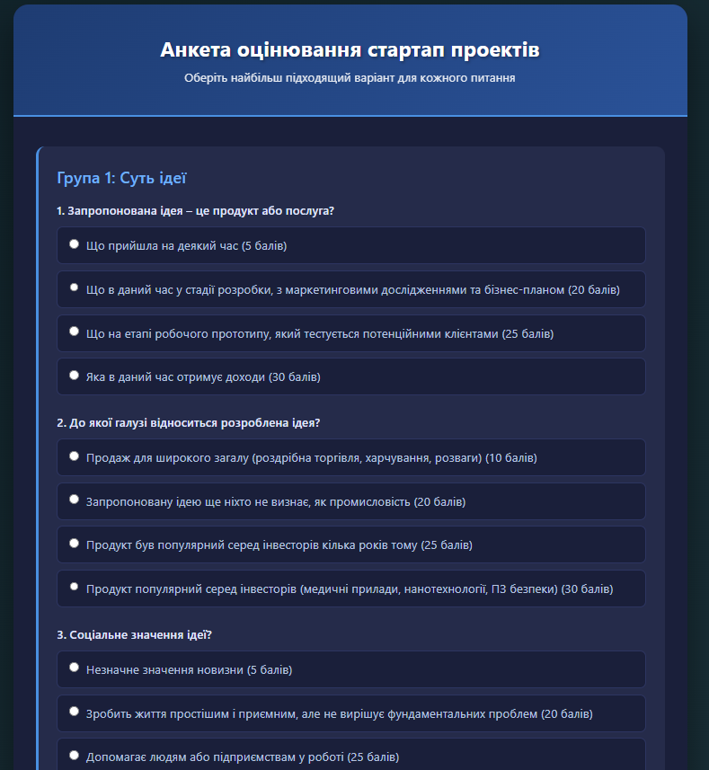

# 📊 Анкета оцінювання стартап проектів

Веб-додаток для комплексного оцінювання стартап-проектів на основі математичної моделі з використанням нечіткої логіки та S-подібних функцій належності.



## 🌟 Особливості

- **21 питання** розподілених по 5 групах критеріїв
- **Математична модель оцінювання** з використанням функцій належності (μ)
- **Візуалізація результатів** через інтерактивні графіки (Chart.js)
- **Темно-синій дизайн** з сучасним UI/UX
- **Адаптивний дизайн** для всіх пристроїв
- **Лінгвістична оцінка** результатів

## 📁 Структура проекту

```
startup-questionnaire/
│
├── index.html          # Основна HTML структура з анкетою
├── style.css          # Стилі (темно-синя колірна схема)
├── script.js          # JavaScript логіка та розрахунки
└── README.md          # Документація проекту
```

## 🚀 Швидкий старт

### Встановлення

1. Клонуйте репозиторій:

```bash
git clone https://github.com/your-username/startup-questionnaire.git
cd startup-questionnaire
```

2. Відкрийте `index.html` у браузері:

```bash
# На macOS
open index.html

# На Linux
xdg-open index.html

# На Windows
start index.html
```

Або просто перетягніть файл `index.html` у вікно браузера.

### Використання

1. Заповніть всі 21 питання анкети
2. Натисніть кнопку **"Розрахувати оцінку"**
3. Переглядайте результати:
   - Бали по кожній групі критеріїв
   - Функції належності (μ)
   - Радар-графік оцінок
   - Стовпчиковий графік порівняння
   - Загальна агрегована оцінка
   - Лінгвістична інтерпретація

## 📋 Групи критеріїв

### Група 1: Суть ідеї (4 питання)

- Тип продукту/послуги
- Галузь застосування
- Соціальне значення
- Сила ідеї

### Група 2: Автори ідеї (3 питання)

- Рівень підприємницького досвіду
- Досвід керівних посад
- Інвестовані години

### Група 3: Порівняльна характеристика (2 питання)

- Основні конкуренти
- Венчурний капітал в галузі

### Група 4: Комерційна значимість (7 питань)

- Стратегічні партнери
- Інтелектуальна власність
- Бізнес-план
- Інвестовані кошти
- Юридична підтримка
- Маркетинговий план

### Група 5: Очікувані результати (5 питань)

- Конкуренція на ринку
- Зростання ринку
- Очікувані доходи (12 міс)
- Очікувані доходи (5 років)
- Валовий прибуток

## 🧮 Математична модель

### S-подібна функція належності

```javascript
μ(x) = {
    0,                              якщо x ≤ a
    2((x-a)/(b-a))²,               якщо a < x ≤ (a+b)/2
    1 - 2((b-x)/(b-a))²,           якщо (a+b)/2 < x < b
    1,                              якщо x ≥ b
}
```

де:

- `x` - отримана кількість балів
- `a` - мінімальна кількість балів
- `b` - максимальна кількість балів

### Агрегована оцінка

```
M = Σ(μᵢ × wᵢ), i = 1..5
```

де:

- `μᵢ` - функція належності для групи i
- `wᵢ` - нормалізована вага групи i
- Ваги за замовчуванням: {10, 8, 6, 7, 4}

### Лінгвістична оцінка

| Діапазон M   | Оцінка                         |
| ------------ | ------------------------------ |
| (0.67, 1]    | 🌟 Оцінка ідеї висока          |
| (0.47, 0.67] | 📈 Оцінка ідеї вище середнього |
| (0.36, 0.47] | 📊 Оцінка ідеї середня         |
| (0.21, 0.36] | 📉 Оцінка ідеї низька          |
| [0, 0.21]    | ⚠️ Оцінка ідеї дуже низька     |

## 🎨 Технології

- **HTML5** - структура
- **CSS3** - стилізація
  - Градієнти
  - Flexbox
  - CSS `:has()` selector
- **JavaScript (Vanilla)** - логіка
  - ES6+
  - Event Listeners
  - DOM Manipulation
- **Chart.js 4.4.0** - візуалізація даних
  - Radar Chart
  - Bar Chart

## 🎨 Колірна схема

```css
/* Основні кольори */
--background: linear-gradient(135deg, #0f2027 0%, #203a43 50%, #2c5364 100%);
--card-bg: #1a1f3a;
--card-bg-light: #252b4a;
--accent-blue: #4a90e2;
--accent-light-blue: #6fb1fc;
--text-primary: #e0e7ff;
--text-secondary: #b8c5e0;
--border: #2d3561;
```

## 📊 Приклад результатів

```
Група 1: Суть ідеї                    70 балів (μ = 0.550)
Група 2: Автори ідеї                  50 балів (μ = 0.900)
Група 3: Порівняльна характеристика   40 балів (μ = 0.880)
Група 4: Комерційна значимість        150 балів (μ = 0.630)
Група 5: Очікувані результати         65 балів (μ = 0.700)

Загальна агрегована оцінка: 0.698
Оцінка: 🌟 Оцінка ідеї висока
```

## 🌐 Браузерна підтримка

- ✅ Chrome 90+
- ✅ Firefox 88+
- ✅ Safari 14+
- ✅ Edge 90+
- ✅ Opera 76+

## 📱 Адаптивність

Додаток повністю адаптивний і працює на:

- 💻 Desktop (1920px+)
- 💻 Laptop (1366px+)
- 📱 Tablet (768px+)
- 📱 Mobile (320px+)

## 🔧 Налаштування

### Зміна вагових коефіцієнтів

У файлі `script.js` знайдіть:

```javascript
const weights = [10, 8, 6, 7, 4] // [Група1, Група2, Група3, Група4, Група5]
```

### Зміна колірної схеми

У файлі `style.css` змініть відповідні кольори в початку файлу.

### Зміна порогів лінгвістичної оцінки

У файлі `script.js` знайдіть блок з умовами:

```javascript
if (aggregated > 0.67) {
	assessment = '🌟 Оцінка ідеї висока'
}
// ...
```

## 📚 Методологія

Проект базується на науковій методології оцінювання стартап-проектів з використанням:

- Нечіткої логіки (Fuzzy Logic)
- Функцій належності (Membership Functions)
- Багатокритеріального аналізу (Multi-Criteria Analysis)
- Зваженої агрегації (Weighted Aggregation)

---
